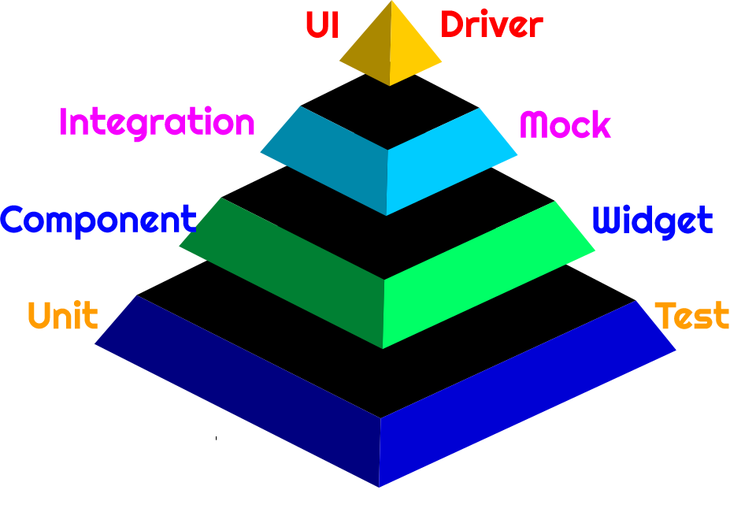

&nbsp;&nbsp;
&nbsp;&nbsp;
&nbsp;&nbsp;
&nbsp;&nbsp;

# Flutter Tester

</img>

Introduction to flutter testing: This repo will teach you about testing in a flutter. It includes unit testing, widget testing & integration testing. 
Udemy Tutorial link: https://www.udemy.com/course/flutter-testing-unit-widget-integration-testing/

 

Learn to write code with TDD approach for Flutter, Learn in detail about Unit, Widget & Integration Testing

## What I've learned?
</img> 
✅ &nbsp;&nbsp;&nbsp;&nbsp;-  Flutter Unit Testing  
✅ &nbsp;&nbsp;&nbsp;&nbsp;-  Flutter Widget Testing  
✅ &nbsp;&nbsp;&nbsp;&nbsp;-  Flutter Integration Testing  
✅ &nbsp;&nbsp;&nbsp;&nbsp;-  Learn to write code with TDD  

## Test Pyramid & TDD Approach

</img>
</img>

